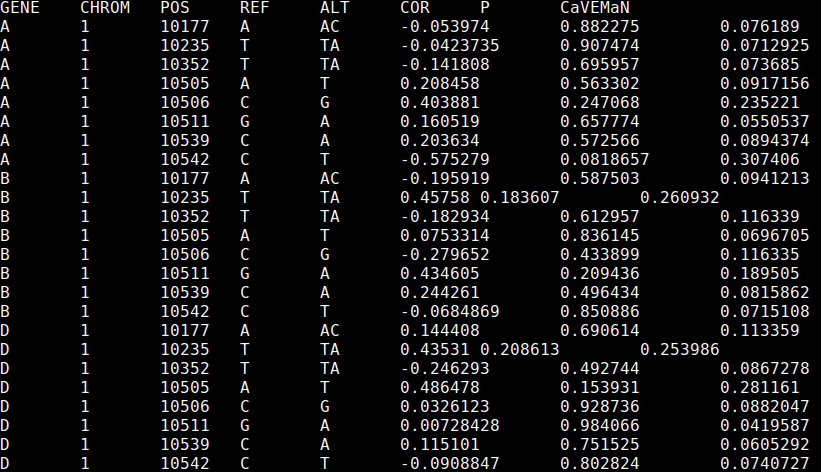
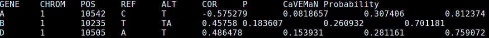

# CaVEMaN Causal Variant Evidence Mapping using Non-parametric resampling

Given the results of an eQTL mapping analysis, together with the expression, genotype and phenotype files, this software will estimate the probability that the peak eQTL is causal. For more details, please see the associated [paper](http://biorxiv.org/content/early/2016/11/21/088872).

***

## Contents

1. [Downloading CaVEMaN](#downloading-caveman)
2. [Input data formats](#input-data-formats)
3. [Creating a single phenotype bed file from an eQTL list](#creating-a-single-phenotype-bed-file-from-an-eqtl-list)
4. [Running CaVEMaN](#running-caveman)
5. [Extracting peak SNPs and estimating causal probabilities](#extracting-peak-snps-and-estimating-causal-probabilities)
6. [Building from source](#building-from-source)

***

## Downloading CaVEMaN

CaVEMaN binaries can be downloaded from here:

[https://github.com/funpopgen/CaVEMaN/releases/tag/v1.0](https://github.com/funpopgen/CaVEMaN/releases/tag/v1.0)

The standard binary is called CaVEMaN. Use CaVEMaN_CentOS if there is an error referring to GLIBC.

CaVEMaN requires tabix to be installed: [https://github.com/samtools/htslib](https://github.com/samtools/htslib).

If there are any issues, you can try [building from source](#building-from-source), or contact andrew.brown@unige.ch.

***

## Input data formats

CaVEMaN uses the same data formats as fastQTL (http://fastqtl.sourceforge.net/), which the exception that the bed file should be uncompressed. To convert the fastQTL bed file run the following line:

    gunzip myphenotypefile.bed.gz

The bed file should only contain genes for which an eQTL has been discovered, unless a set of conditional eQTLs have been produced, in which case the next section explains how to produce a new bed file from this list. This requires a list of eQTL, which should be a tab-separated file with no header, and the following fields to uniquely determine the SNP-gene pairs:

1. Gene
2. Chromosome
3. Base pair location
4. Reference allele
5. Alternate allele

The --correct option can also take a covariates file. This should be tab separated, the first row should contain subject IDs, and there should be one row for each covariate.

***

## Creating a single phenotype bed file from an eQTL list

CaVEMaN is based on the assumption that there is only one eQTL signal in the cis window. In cases where multiple eQTLs are known for a given gene, we can produce "single signal" phenotypes by regressing out all but one eQTL at a time (and optionally covariates as well). Given an expression bed file (expression.bed), a genotype file (genotype.vcf.gz) and a list of eQTL (eqtl.list), we produce the file with the following command:

     CaVEMaN --correct eqtl.list --bed expression.bed --vcf genotype.vcf.gz \
         --out corrected.expression.bed

If a set of important covariates are known (covariates.txt) were included in the eQTL mapping, these can be considered as well:

     CaVEMaN --correct eqtl.list --bed expression.bed --vcf genotype.vcf.gz \
         --out corrected.expression.bed --cov covariates.txt

***

## Running CaVEMaN

To run CaVEMaN, all that is necessary is a bed file containing expression values (expression.bed) and a vcf file containing genotype values (genotype.vcf.gz, either the DS or GT field must be present).

CaVEMaN has been designed so that the full analysis can be broken up into chunks, which can be submitted as cluster jobs separately. This requires two flags (if neither are present the whole analysis will be submitted), --genes specifies the number of genes to be analysed in each job, --job-number indexes the job. Therefore, if --genes 10 is specified, --job-number 1 will analyse genes 1-10 in the bed file, --job-number 2 will process genes 11-20 and so on.

To submit a job array, with a bed file of 9,995 genes, where each job analyses 50 genes (9,995 / 50 = 199.9, so we need to run 200 jobs to cover all genes), we would submit the following command to an LSF cluster:

     bsub -o out -J"CaVEMaN[1-200]" \
         "CaVEMaN --bed expression.bed --vcf genotype.vcf.gz --genes 50 \
         --job-number \$LSB_JOBINDEX --out results\$LSB_JOBINDEX"

In addition, the --perm option allows you to set the number of bootstrap samples used in the analysis.

This command will produce 200 results files, results1-results200. To concatenate them together run:

     awk 'FNR>1||NR==1' results* > results.all

The output should look like this:

The output contains every SNP in the cis window, the first five fields specify the gene and SNP, Cor and P fields give the results of a simple correlation analysis of SNP and gene, and CaVEMaN gives the CaVEMaN score, a measure of whether this SNP is causal.

***

## Extracting peak SNPs and estimating causal probabilities

Once the CaVEMaN analysis is complete, we can parse the results file to extract the SNP most likely to be causal, and calculate its causal probability (using the results of simulations). To do this run the following command:

     CaVEMaN --best results.all --out results.best

The file results.best should look like this:

The file contains the same fields as before, with the addition of the "Probability" column which gives the probability the SNP is causal.

***

## Building from source

This requires a D compiler and a version of the GNU scientific library, version 2.1 or above.

### Cloning the repository

First, clone the repository by running:

    git clone https://github.com/funpopgen/CaVEMaN.git

This should create a folder called CaVEMaN. Inside this folder is a file called makefile, in the first four lines we can specify the location of the D compiler and also where the gsl library is (if it is not already installed on your cluster).

### Download a D compiler

Then, download a D compiler from either here: [https://github.com/ldc-developers/ldc/releases](https://github.com/ldc-developers/ldc/releases) or here: [http://dlang.org/dmd-linux.html](http://dlang.org/dmd-linux.html) (ldc produces faster software, my experience is that dmd works better on older operating systems). Decompress the downloaded file, then edit either the third or fourth line of the makefile in the CaVEMaN folder so that it contains the full path to the relevant compiler, i.e. either:

**DMD = /path/to/dmd2/linux/bin64/dmd**

or

**LDC = /path/to/ldc2-1.1.0-beta2-linux-x86_64/bin/ldc2**

### Installing, if necessary, gsl v2.1

First, check if a sufficiently recent version of the gsl is already installed by running:

     gsl-config --version

If this states that version 2.1 or more recent is installed, you can move on to building the software.

Otherwise, download the gsl from here: [http://mirror.switch.ch/ftp/mirror/gnu/gsl/gsl-2.1.tar.gz](http://mirror.switch.ch/ftp/mirror/gnu/gsl/gsl-2.1.tar.gz).

Create a folder to install it to called gsl, then run the following commands:

    tar -xf gsl-2.1.tar.gz
    cd gsl-2.1/
    ./configure prefix=/path/to/gsl
    make
    make install

Then, edit the second line of the makefile in the CaVEMaN folder to give it the full path to the gsl folder you created, i.e.

**GSL = /path/to/gsl**

### Building the software

Now to compile, run the commands from the relevant cell in the table (which depend on which compiler you downloaded and whether the gsl was pre-installed).

|      | ldc | dmd |
|----- |-----|-----|
|**GSL already installed** | make test && make | make dmd_test && make dmd |
|**GSL installed by  you** | make static_test && make static | make dmd_static_test && make dmd_static |

Now the CaVEMaN binary should be within the bin folder in the CaVEMaN directory, running

     ./bin/CaVEMaN --help

should bring up the help.
